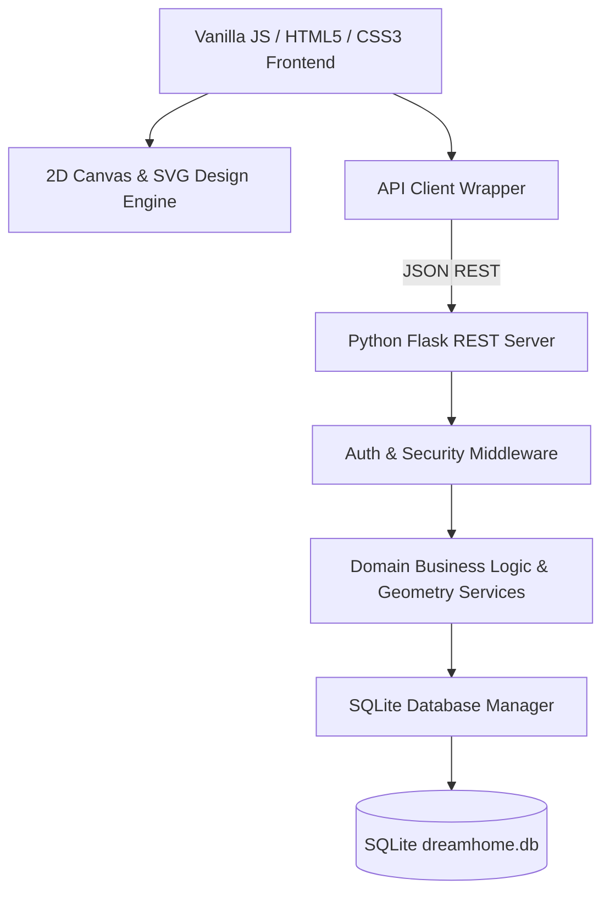

# DreamHome Studio — Architecture Blueprint

## System Overview

DreamHome Studio follows a modular, decoupled 3-tier architecture:

---

## Component Layers

### 1. Frontend Layer (`static/`)
* **HTML5 Canvas 2D Engine (`static/js/engine/`)**:
  * `canvas_engine.js`: Render loop, camera viewport transformation (pan/zoom), coordinate space conversion, selection rendering.
  * `geometry.js`: Client-side 2D vector math, Shoelace polygon area calculations, point distance, rotated rectangle bounding boxes.
  * `wall_tool.js`: Architectural wall drawing, dimension labels.
  * `opening_tool.js`: Door & window insertion with wall snapping.
  * `object_manager.js`: Furniture object state, z-index layering, selection.
  * `transform_tool.js`: Movement drag, corner resize handles, 1-degree rotation handle.
  * `texture_manager.js`: Wall paint, wood grain, tile grid pattern rendering.
  * `lighting_engine.js`: Point & ambient lighting radial gradient overlays.
  * `history_manager.js`: Multi-level Undo/Redo immutable state stack.
  * `exporter.js`: Render canvas to PNG, SVG XML, or JSON schema.

* **UI View Controllers (`static/js/views/`)**:
  * `dashboard_view.js`: Metrics, KPI summary cards, SVG charts.
  * `designer_view.js`: 2D Studio workspace setup, property inspector, catalog drawer.
  * `projects_view.js`: Projects grid, project creation wizard.
  * `budget_view.js`: Cost calculator, budget line items table.
  * `inventory_view.js`: Warehouse stock levels, reorder warnings.
  * `tasks_view.js`: Task board, priority filtering, timeline items.
  * `admin_view.js`: User management, security audit log viewer.

### 2. Backend Server Layer (`backend/`)
* **REST API Blueprints (`backend/api/`)**: 15 modular Flask blueprints handling JSON requests for Auth, Projects, Floorplans, Catalog, Inventory, Suppliers, Budget, Tasks, Moodboards, Portfolios, Reports, Analytics, Admin, Notifications.
* **Domain Models (`backend/models/`)**: 14 object access models executing parameterized SQL queries.
* **Business Services (`backend/services/`)**:
  * `geometry_service.py`: Polygon room area, perimeter, segment intersections.
  * `cost_calculator_service.py`: Itemized furniture/material pricing, tax, labor, designer margins.
  * `floorplan_exporter.py`: Vector SVG XML builder.
  * `floorplan_analysis_service.py`: Room layout clearance audit, density calculation, lighting scores.
  * `supplier_order_service.py`: Purchase order generator, restocking workflows.
  * `analytics_engine.py`: SaaS KPIs, status breakdown, audit feeds.
  * `security_service.py`: Token generation, input sanitization, password validation.

### 3. Database Layer (`database/`)
* **SQLite Relational Engine (`database/db_manager.py`)**: Thread-safe connection pool, WAL journal mode, parameterized query execution, transaction wrapper.
